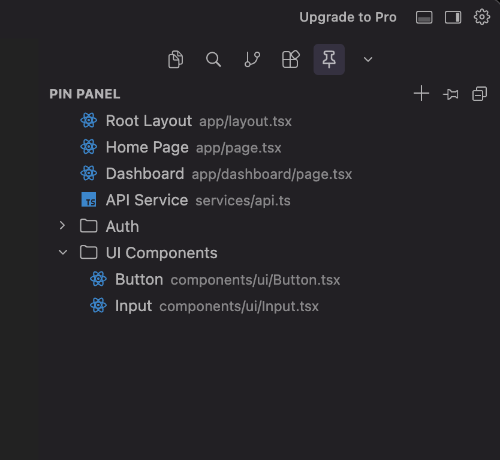
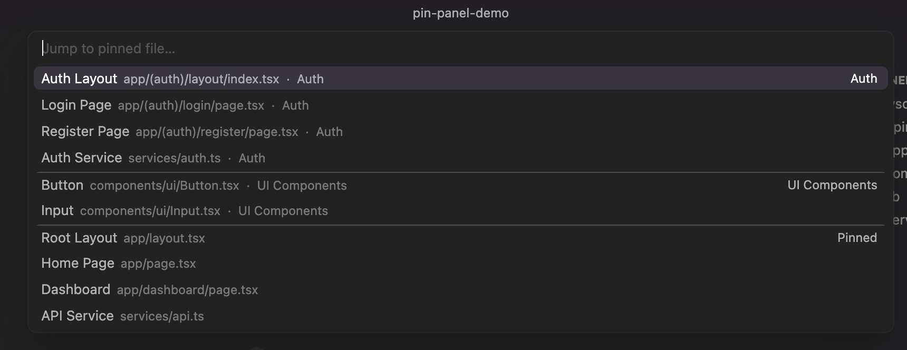
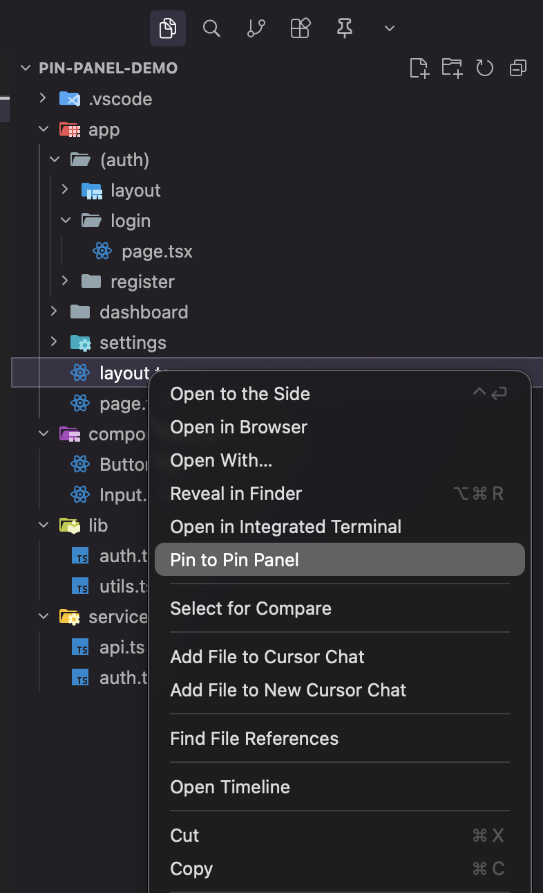
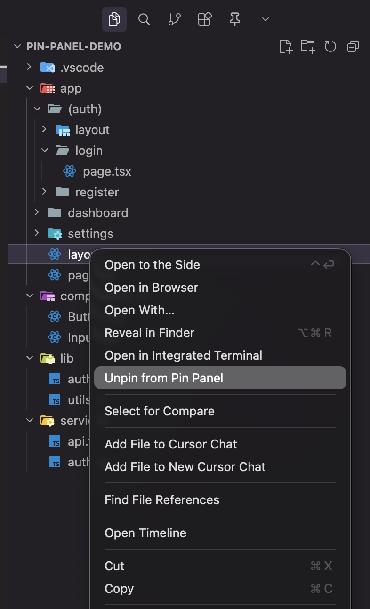
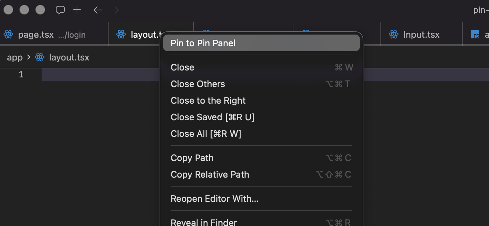
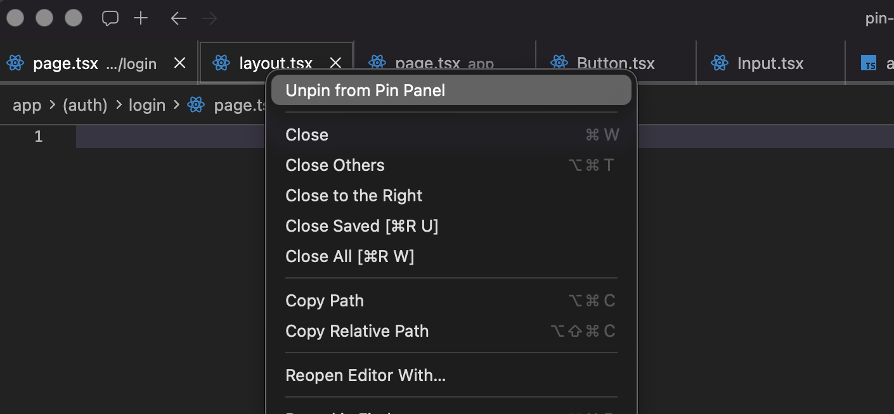
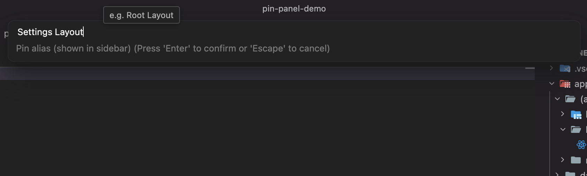

# Pin Panel

> Bookmark files with custom aliases in a dedicated sidebar — built for any codebase where dozens of files share the same name.

---

## The problem

In any large codebase, file name collisions are unavoidable. A Next.js or React project might have 30 files called `page.tsx`, 15 called `layout.tsx`, and dozens more named `index.tsx` or `helper.ts`. A Python service can have 20 files called `utils.py`, `models.py`, or `__init__.py` spread across nested packages. A monorepo with multiple frameworks will have all of the above — plus `index.js`, `types.ts`, `routes.py`, and `config.ts` repeating in every module.

VS Code's built-in tab pinning keeps them open but doesn't help you navigate. The "Go to File" picker shows the raw filename — not the feature, service, or component it belongs to.

**Pin Panel** gives you a dedicated panel where every bookmark has a human-readable alias you choose. Jump to "Auth Layout" instead of hunting through `app/(auth)/layout/index.tsx`.

---

## Features

### Sidebar panel
- Dedicated view in the activity bar (pin icon)
- **Ungrouped pins** float at the top
- **Groups** render below as collapsible sections
- Each pin shows your alias prominently and the real path below it
- Missing files show a warning icon instead of crashing



### Drag and drop
- Reorder pins within ungrouped or within a group
- Drag a pin into a group, or back out to ungrouped
- Reorder groups themselves

### Quick jump — `Cmd+Shift+;` / `Ctrl+Shift+;`
- Fuzzy-search all pinned files **by alias**, not filename
- Searching `auth` finds "Auth Layout" even though the file is `index.tsx`
- Shows a `pin · GroupName` badge next to each result



### Open sidebar — `Cmd+Shift+]` / `Ctrl+Shift+]`
- Instantly focuses the Pin Panel in the activity bar

### Context menus
**Right-click a pin in the sidebar:**
- Rename alias
- Move to group
- Copy path
- Unpin file

**Right-click any file in the Explorer or tab bar:**
- Pin to Pin Panel → prompts for alias → optionally assign to a group
- Unpin from Pin Panel (shown instead when the file is already pinned)

**Explorer:**

 

**Tab bar:**

 

---

## Usage

### Pin a file
Right-click any file in the **Explorer sidebar** or **tab bar** → **Pin to Pin Panel**

Or open a file and click the **pin** button in the Pin Panel header.

You'll be prompted to enter a custom alias:



### Create a group
Click **New Group** in the panel header and give it a name (e.g. `Routes`, `Auth`, `API`).

### Jump to a pinned file
Press **`Cmd+Shift+;`** (Mac) / **`Ctrl+Shift+;`** (Windows/Linux) and start typing the alias.

### Open the sidebar
Press **`Cmd+Shift+]`** (Mac) / **`Ctrl+Shift+]`** (Windows/Linux) to focus the Pin Panel in the activity bar.

### Customizing keybindings
To rebind either shortcut to something that works better for you:

1. Open Keyboard Shortcuts — `Cmd+K, Cmd+S` (Mac) / `Ctrl+K, Ctrl+S` (Windows/Linux)
2. Search for the command you want to rebind:
   - **`Pin Panel: Quick Lookup`** — the fuzzy file jump
   - **`Pin Panel: Show Panel`** — opens the sidebar
3. Click the pencil icon next to it and press your preferred key combination.

### Reorder
Drag and drop pins and groups within the panel.

---

## Storage

Pins are saved to `.vscode/pin-panel.json` in your workspace root — commit it to share your pin layout with your team.

```json
{
  "groups": [
    { "id": "abc-123", "name": "Routes" }
  ],
  "pins": [
    { "id": "def-456", "alias": "Root Layout", "relativePath": "app/layout.tsx", "groupId": null },
    { "id": "ghi-789", "alias": "Auth Layout", "relativePath": "app/(auth)/layout/index.tsx", "groupId": "abc-123" }
  ]
}
```

- `groupId: null` = ungrouped
- A file can only be pinned once
- Array order defines display order — drag and drop updates this

---

## Requirements

VS Code 1.74 or later. Also works in **Cursor**, **Windsurf**, and **VSCodium**.

---

## Contributing

Issues and PRs welcome at [github.com/zerodawnstudios/pin-panel](https://github.com/zerodawnstudios/pin-panel).

---

## License

MIT
